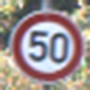
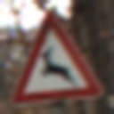

# Traffic sign classifier

Classify Traffic Signs from [German Traffic Sign Dataset](http://benchmark.ini.rub.de/?section=gtsrb&subsection=dataset).
Each image is 32x32 pixels and belongs to one of 43 classes. Training and inference are achieved using Keras with either Tensorflow or Theano as backend.
The dataset (124 MB) is downloaded automatically and consists of three parts: `train, valid, test`.






## Run

Consider running the inference script to make sure that prerequisites are correctly installed. Accuracy should be around 96% on the test set.

### Inference
Perform inference using existing pre-trained model.

    python inference.py

### Training
Train new model from scratch.

    python train.py

## Prerequisites

Python 3.5 is recommended since OpenCV installation is straightforward with this release whereas somewhat trickier on Python 3.6.
Version numbers below are of confirmed working releases for this project.

    python 3.5.3
    pandas 0.20.3
    opencv 3.1.0
    keras 2.0.6
    tensorflow 1.2.1
    sklearn 0.18.2
    tqdm 4.15.0
    scipy 0.19.1
    numpy 1.13.1

## Installation using Anaconda
It is recommended to use a virtual environment so that python packages can be easily reverted.
Instructions for installation using Anaconda will assist in preparing your environment for this project.

0. Install [Anaconda Python 3](https://www.continuum.io/downloads)
0. Add Anaconda directories to PATH as necessary (e.g. for Windows: Anaconda3, Anaconda3\\Scripts)
0. Training and inference
```
    conda create -n traffic_signs python=3.5

    macOS/Ubuntu:
    source activate traffic_signs
    pip install keras tensorflow sklearn pandas tqdm scipy numpy h5py
    conda install -c menpo opencv

    Windows:
    activate traffic_signs
    conda install scipy numpy tensorflow scikit-learn pandas tqdm h5py
    pip install keras
    conda install -c menpo opencv3
```
0. Optional: Save model diagram (Ubuntu, macOS)
```
    macOS: brew install graphviz
    Ubuntu: apt install graphviz
    pip install graphviz pydot
```
